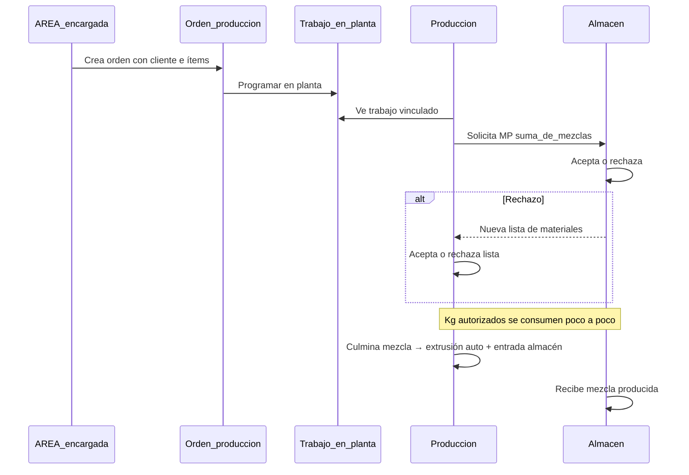

# Informe de Sistema de Producción (Alba) — referencia organizada

Documento maestro: transcripción del informe de operaciones, traducción a la UI acordada con Valeria, roadmap de implementación y estado actual del código.

**Leer junto con:** [GLOSARIO.md](./GLOSARIO.md) · [HANDOFF-NEXT-SPRINT.md](./HANDOFF-NEXT-SPRINT.md) · [API.md](./API.md)

---

## 1. Nota general (fuente Alba)

El informe describe el ciclo de producción, el manejo de mezclas y el flujo de solicitudes entre **AREA**, **Producción** y **Almacén**. El “ejemplo visual” del documento original **no es una hoja Excel**: es una guía de qué datos capturar (cabecera + líneas).

---

## 2. Traducción Alba → pantalla (Valeria)

| Alba / operaciones | En pantalla (usuario) | Código / API |
|--------------------|----------------------|--------------|
| N° Orden de Producción (AREA) | **Orden de producción** | `client-orders`, `features/nroc-orders/` |
| NROP / código interno en planta | **Trabajo en planta** / Programación | `work-orders`, `features/programacion/` |
| Orden de compra proveedor | **Órdenes de compra** | `purchase-orders` |
| Solicitud a almacén | **Solicitudes de insumos** / **Solicitudes entre áreas** | `material-requests`, `area-requests` |
| Registro por NROP + turno + máquina | **Registro de extrusión** | `/extrusion/registro`, `extrusion-runs` |

**No mostrar en UI:** siglas NROC, NROP, módulo “Administración”, Palectizado como flujo separado (pausado).

---

## 3. Ciclo de producción (sección 1 del informe)

### 3.1 Flujo general



### 3.2 Reglas de negocio (texto Alba)

| Paso | Regla |
|------|--------|
| AREA | Genera el número / orden de lo que el cliente pide fabricar. |
| Producción | Ve la orden y solicita a **Almacén** materia prima para ese trabajo, en kg = **suma total de las mezclas**. |
| Almacén | **Acepta** o **rechaza**. Si rechaza (producto no encontrado), genera **otra solicitud** con lista distinta. |
| Producción | **Acepta o rechaza** la nueva lista del almacén. |
| Gestión MP | Se pide un cupo total de kg al inicio; cada salida parcial **resta** del cupo (“sacan las órdenes poco a poco”). |
| Culminar mezcla | Si hay kg producidos en este trabajo: **auto-crea registro de extrusión** y **solicitud de entrada a almacén** (`request_flow=inbound`). |

### 3.3 Cabecera y líneas (ejemplo visual — no es Excel)

Campos de referencia para la **orden de producción**:

| Campo ejemplo | Implementación |
|---------------|----------------|
| Número de orden | `code` (API) |
| Fecha | `ordered_at` |
| VENTA Para | `sale_for` |
| Cliente | `client_id` + nombre |
| RIF / Dirección | Del maestro cliente (solo lectura en formulario) |

Líneas de ítem:

| Columna ejemplo | Campo actual |
|-----------------|--------------|
| Ítem | Número de línea |
| Cantidad | `quantity` |
| Kg | `quantity` + `unit` = kg |
| Unidades | `unit` |
| Descripción | `description` |

---

## 4. Módulo de mezclas (sección 2 del informe)

### 4.1 Flujo operativo Alba

1. Entrar por **trabajo en planta** (NROP en Alba).
2. Ver mezclas existentes de ese trabajo.
3. Seleccionar mezcla → botón **Empezando producción** → guardar.
4. Pueden ser **varias mezclas a la vez**.
5. Salir y volver a entrar por el mismo trabajo.
6. **¿Culminada producción de la mezcla?** SÍ / NO.
7. **¿Utilizaste completamente esta mezcla?**
   - **SÍ:** registro de producción → guardar → **extrusión auto** + **solicitud entrada almacén**.
   - **NO:** razón → ¿usada en otra orden?
     - Opción 1: registro con kg restante → extrusión + entrada almacén por kg producido.
     - Opción 2: indicar otra orden → queda en **historial cruzado** de ambas (sin entrada si todo se traslada).

### 4.2 Casos especiales

| Caso | Acción |
|------|--------|
| Aún queda mezcla por terminar | Continuar producción |
| No queda mezcla | Solicitar más MP si **quedan kg** del cupo inicial |
| Varias mezclas | Repetir ciclo por cada mezcla |

### 4.3 Fases de implementación

| Fase | Alcance | Estado |
|------|---------|--------|
| **P2** | Selector de trabajo + listado filtrado + enlace desde Programación | **Hecho** |
| **P2b** | Wizard: empezando / culminada / sobrante / historial cruzado + cierre auto extrusión/entrada | **Hecho** (`/mezcla/produccion`) |

---

## 5. Registro de producción general (cuadro del día)

Alba: el cuadro se llena solo al registrar por **trabajo + turno + máquina**; al cierre del día se conoce el **total kg**.

| Elemento | Dónde en el sistema |
|----------|---------------------|
| Captura micrajes + kg/bobina | `/extrusion/registro` — bobinas 1–5, temporizador, formato, desperdicio, cambio orden |
| Total del formulario | Suma en vivo en hook |
| Total del día / mes | `/extrusion` resumen diario + dashboard `extrusion_month_kg` |
| API persistencia | `GET/POST /api/extrusion-runs`, `GET …/daily-summary` |
| Extrusión desde mezcla | Auto al `POST mixture-production-runs/{id}/complete` (máquina `mezcla`) |

---

## 6. Producción / Palectizado y Administración (pausado)

Texto Alba (no implementar en MVP):

- Producción y **Palectizado** piden a **Administración** un número para solicitar MP al almacén.
- Valeria: **sin** pantalla Administración; Heliana opera desde la orden de producción.
- Futuro (si se reactiva): `origin` (`from_client_order` \| `stock`), `production_area` (`extrusion` \| `palectizado`).

---

## 7. Roadmap de implementación (orden acordado)

| # | Prioridad | Qué | Por qué | Estado | Dónde actuar |
|---|-----------|-----|---------|--------|--------------|
| **P1** | Registro extrusión | `/extrusion/registro` | Cuadro del día (micrajes, kg, turno, máquina) | **Hecho** | `features/production/extrusion/` |
| **P2** | Mezcla ↔ trabajo | Filtro y selector por `work_order_id` | Primer paso módulo mezclas Alba | **Hecho** | `tinta-mixtures/`, enlace en `programacion/` |
| **P3** | Orden de producción | RIF/dirección lectura, `sale_for`, líneas cantidad/kg/unidad/descripción | Acercar formulario al ejemplo visual | **Hecho** | `nroc-orders/`, backend `client-orders/` |
| **P4** | Solicitudes + saldo kg | Aceptar/rechazar/contra-lista; cupo kg decreciente; entrada producción | Ciclo Producción ↔ Almacén completo | **Hecho** | `material-requests/`, `area-requests/`, backend |
| **P2b** | Wizard mezclas + cierre | Culminar → extrusión + inbound + historial | Cierre del informe Alba §4 | **Hecho** | `/mezcla/produccion`, `mixture-production-runs` |
| **—** | Despacho | Paletas, nota, hablador | Después de extrusión | **Hecho (MVP)** | `/despacho`, `features/dispatch/` |
| **—** | Reportes | 3 reportes | Operación / dirección | **Hecho (MVP)** | `/reportes`, `features/reports/` |
| **⏸** | Admin, Palectizado, NROP stock | — | Fuera de MVP Valeria | Pausado | — |

---

## 8. Estado actual del código (checklist)

### Hecho

- [x] Orden de producción (listado + formulario líneas, `sale_for`, RIF/dirección cliente)
- [x] Programación (programar → trabajo en planta, etapas)
- [x] Mezcla vinculada a trabajo (filtro, formulario, enlace Programación)
- [x] **Wizard producción mezcla** (`/mezcla/produccion`): empezar, culminar, sobrante, traslado a otro trabajo
- [x] **Cierre wizard**: auto extrusión + solicitud entrada almacén (`request_flow=inbound`, `POST …/receive`)
- [x] **Historial cruzado** por trabajo (`GET mixture-production-runs/history`)
- [x] Extrusión hub + registro + resumen diario
- [x] Solicitudes insumos y bandeja almacén (autorizar/despachar, rechazo/contra-lista, saldo kg, recibir entrada)
- [x] Despacho paletas (MVP)
- [x] Reportes operativos (MVP)
- [x] Backend núcleo producción (`client-orders`, `work-orders`, `tinta-mixtures`, `extrusion-runs`, `material-requests`, `mixture-production-runs`, `dispatch`, `reports`)
- [x] Devoluciones, movimientos, materiales
- [x] Terminología UI según [GLOSARIO.md](./GLOSARIO.md)

### Prueba E2E

Scripts:

- `backend/scripts/e2e_flow_test.py` — flujo mezcla completo
- `backend/scripts/e2e_extrusion_test.py` — registro extrusión Alba (temporizador, desperdicio, devolución mala)

```bash
cd backend && .venv/Scripts/python scripts/e2e_flow_test.py
```

### Pendiente / mejoras futuras (no bloquean MVP)

- [ ] Vincular `material_id` en líneas de solicitud inbound (inventario de tinta terminada)
- [ ] Detalle `GET extrusion-runs/{id}` con `mixture_production_run_id`
- [ ] Migraciones Alembic (hoy `create_all`; DB existente puede requerir borrar `axones_acarigua.db`)

---

## 9. Archivos clave por módulo

| Módulo | Carpeta frontend | Endpoints API |
|--------|------------------|---------------|
| Orden de producción | `features/nroc-orders/` | `client-orders` |
| Programación | `features/programacion/` | `work-orders` |
| Mezcla | `features/tinta-mixtures/` | `tinta-mixtures`, `mixture-production-runs` |
| Registro extrusión | `features/production/extrusion/` | `extrusion-runs` |
| Solicitudes | `features/material-requests/`, `area-requests/` | `material-requests`, `area-requests` |
| Despacho | `features/dispatch/` | `dispatch` |
| Reportes | `features/reports/` | `reports` |
| Inventario | `features/materials/`, `inventory-*` | varios |

---

## 10. Cómo continuar (sin desorden)

1. Abrir este archivo + [GLOSARIO.md](./GLOSARIO.md).
2. Ejecutar `e2e_flow_test.py` tras cambios en flujo producción.
3. Al terminar cada prioridad: `npm run build`, actualizar §8 y [HANDOFF-NEXT-SPRINT.md](./HANDOFF-NEXT-SPRINT.md).
4. No reabrir debate NROC/NROP en UI ni implementar ítems **⏸ Pausado** sin nueva decisión de producto.
